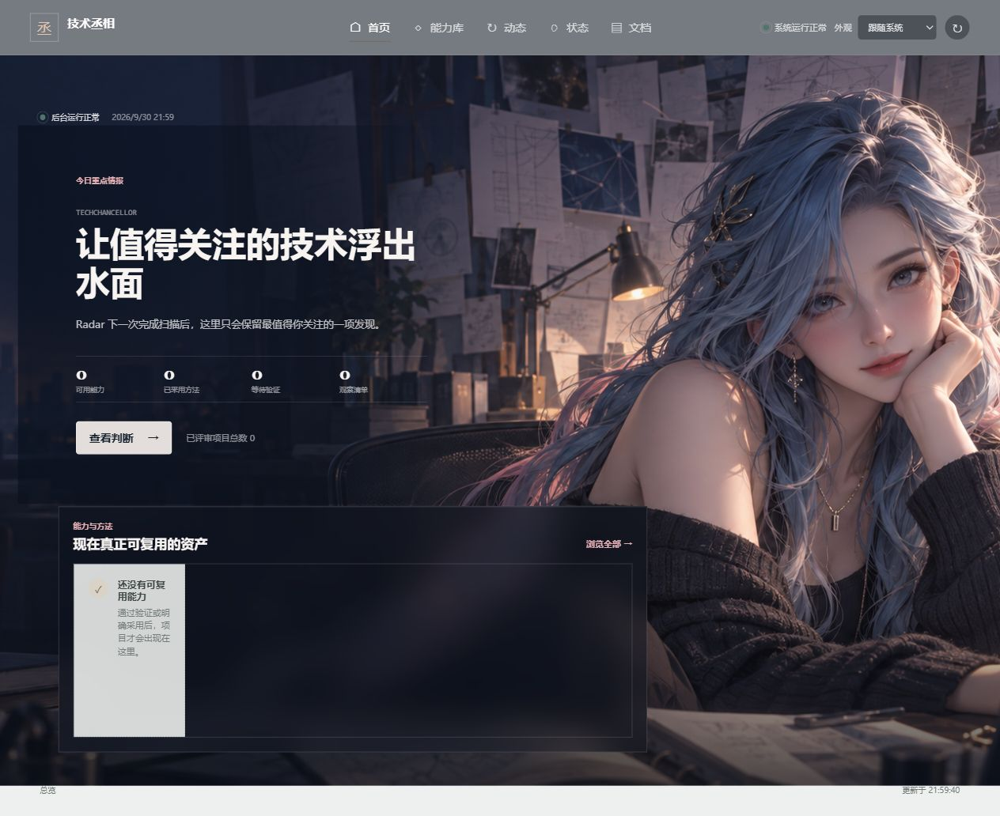

# TechChancellor

**Know what your AI can already do, what it is missing, and safely discover, verify, activate and reuse new capabilities.**

TechChancellor is a local capability control center, not another GitHub bookmark list or an automatic installer. It keeps evidence for what was reviewed, what is usable, and what has actually been used.

[中文](README.zh-CN.md) · [Quick Start](#quick-start-windows) · [User Guide](docs/USAGE.md) · [Release Notes](docs/releases/v0.2.0.md)



## The Loop

**Discover → Understand → Verify → Activate → Reuse → Keep Fresh**

Radar finds public projects. Chancellor judges incremental value against your existing capabilities. Supported low-risk paths can be validated and made available; production consumers record real use. Newly discovered candidates return to the same final-review pipeline.

A **source** is where evidence comes from; an **implementation** is one way to deliver it; a **capability** is what you can do. One repository may provide several capabilities, and several repositories may implement the same capability. A bookmark is not proof of ownership or usefulness.

## Quick Start (Windows)

Requires Python 3.11+ and Git. Python runtime dependencies are standard-library only. Codex CLI, authenticated GitHub reads, and scheduled tasks are optional.

```powershell
git clone https://github.com/zhaoruijiang9/tech-chancellor.git
cd tech-chancellor
python -m venv .venv
.venv\Scripts\python.exe -m pip install -r requirements.txt
.venv\Scripts\python.exe run.py init
.venv\Scripts\python.exe run.py health
.venv\Scripts\python.exe run.py dashboard --browser
```

The default launcher is `打开技术丞相.cmd`; it opens a desktop-style local browser window. `init` is repeatable, preserves existing local choices, and does not install capabilities or scheduled tasks. A fresh installation starts with zero reviewed sources and zero personal capabilities.

For the first bounded, public-read-only discovery, in a second terminal:

```powershell
.venv\Scripts\python.exe run.py scan --config config/discovery.quickstart.json --dry-run
.venv\Scripts\python.exe run.py build-library
.venv\Scripts\python.exe run.py my-capabilities
```

Anonymous GitHub API limits may produce an explicit degraded result; the base dashboard remains usable. This scan does not invoke Codex, install a project, or execute third-party code.

## A Real Workflow

The read-only index from [awesome-claude-skills](https://github.com/ComposioHQ/awesome-claude-skills) was pinned, quarantined, statically reviewed, rollback-tested and functionally evaluated. Its Skill Ecosystem Discovery capability became AVAILABLE, then a real Radar consumer invocation supplied the evidence for USED.

It discovered [context-engineering-kit](https://github.com/NeoLabHQ/context-engineering-kit). Bounded README evidence passed canonical admission and reached the formal Chancellor. The actual final decision was **REFERENCE_ONLY**: substantial overlap, no demonstrated incremental benefit. The candidate was not installed or executed.

The outcome illustrates the product: useful discovery does not have to end in unnecessary installation. This example describes a verified workflow; it is not seeded into new installations.

## Safety and Limits

**SAFE_BY_CONTAINMENT:** automatic paths must be low-risk, bounded, reversible and supported by an existing adapter. Local preliminary screening and final Chancellor review are separate stages.

v0.2.0 does **not** automatically execute arbitrary third-party Python, Node, CLI or MCP services. A secure third-party execution sandbox remains a missing platform capability. Credentials, privileged operations, services, financial accounts and protected projects require appropriate human boundaries.

Runtime SQLite, approvals, installed versions, pointers, usage receipts, caches and personal reports stay local and are not release defaults. Generic guidance is public; `CONFIG != STATE`.

## Optional Components

- Codex CLI: required for formal Stage B and semantic delta review, not for initialization or the dashboard. Model priority: `PTI_STAGE_B_MODEL` → ignored `config/stage_b.local.json` → legacy ignored `config/stage_b.json` → Codex CLI default. See [configuration](docs/USAGE.md#codex-and-models).
- GitHub authentication: optional higher public API limits through process environment `GH_TOKEN` or `GITHUB_TOKEN`; never commit a credential.
- Windows Scheduler: explicit opt-in deployment, not an installation requirement. See [scheduling](docs/USAGE.md#scheduling).
- Obsidian: optional Markdown reader; the Control Center includes its own document view.

## Upgrade from v0.1.0

Stop your local background runs, back up `state/` and any local config/install directories outside the checkout, then update and run `python run.py init`. Schema initialization is idempotent and preserves valid historical records. Do not delete the database. See [upgrade precautions](docs/USAGE.md#upgrade).

## Feedback

Bugs, useful/noisy discoveries, capability recommendations, installation problems and safety-boundary feedback are welcome.

- [GitHub Issues](https://github.com/zhaoruijiang9/tech-chancellor/issues)
- [GitHub Discussions](https://github.com/zhaoruijiang9/tech-chancellor/discussions)
- Private contact: **2565455406@qq.com**

[Apache-2.0](LICENSE). v0.2.0 is an early developer tool, not an enterprise-readiness or profitability claim. [Changelog](CHANGELOG.md) · [Contributing](CONTRIBUTING.md) · [Documentation](docs/README.md)
